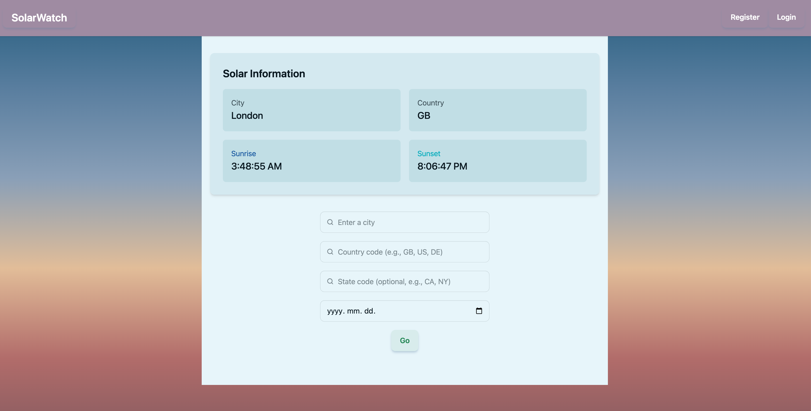

# SolarWatch

[](https://github.com/your-username/solarwatch/actions/workflows/maven.yml)

<details>
<summary><h2><strong>Table of Contents</strong></h2></summary>
  
- [SolarWatch](#solarwatch)
  - [About The Project](#about-the-project)
    - [Features](#features)
  - [Built With](#built-with)
  - [CI/CD Pipeline](#cicd-pipeline)
    - [Pipeline Features](#pipeline-features)
    - [Workflow Triggers](#workflow-triggers)
    - [Pipeline Jobs](#pipeline-jobs)
  - [Getting Started](#getting-started)
    - [Prerequisites](#prerequisites)
    - [Installation Steps](#installation-steps)
      - [Docker Setup (Recommended)](#docker-setup-recommended)
  - [Usage](#usage)
    - [Retrieving Sunrise and Sunset Times](#retrieving-sunrise-and-sunset-times)
    - [Default Login Credentials](#default-login-credentials)
  - [Project Structure](#project-structure)
  - [Acknowledgments](#acknowledgments)
  
</details>

## About The Project

**SolarWatch** is a web application that provides accurate **sunrise** and **sunset** times for any specified **city** and **date**. To maximize **efficiency** and reduce redundant **external API calls**, it utilizes a local **database** to **cache** frequently requested data. If the requested information is not available locally, **SolarWatch** automatically **fetches** it from an **external API** and **stores** it for future use, ensuring **fast** and **reliable** responses for subsequent requests.



### Features

  - **City/date lookup** with accurate sunrise and sunset data
  - **Caching** via a local database to minimize external API calls
  - **Secure authentication** with role-based access

The entire application is containerized using **Docker Compose**, enabling seamless **deployment** and **scalability**.

## Built With

- **Backend:**  
  [](https://spring.io/projects/spring-boot)

- **Frontend:**  
  [](https://reactjs.org/)  
  [](https://vitejs.dev/)  
  [](https://tailwindcss.com/)

- **Database:**  
  [](https://www.postgresql.org/)

- **Containerization:**  
  [](https://www.docker.com/)  
  [](https://www.nginx.com/)

## CI/CD Pipeline

This project uses **GitHub Actions** for continuous integration to ensure code quality and stability.

### Pipeline Features

- **Automated Backend Testing**: Runs comprehensive test suite for Spring Boot application
- **Build Verification**: Validates that both backend and frontend build successfully
- **Pull Request Validation**: Automatically checks all incoming changes

### Workflow Triggers

The CI pipeline runs automatically on:
- **Push to main branch** - Validates all changes to the main codebase
- **Pull requests** - Ensures proposed changes don't break existing functionality
- **Manual dispatch** - Can be triggered manually when needed

### Pipeline Jobs

| Job | Description | Tools |
|-----|-------------|-------|
| **Backend Tests & Build** | Runs Java/Spring Boot unit and integration tests, then builds the application | Maven + JUnit |
| **Frontend Build** | Ensures React application compiles successfully | Vite + Node.js |

Backend tests must pass and both applications must build successfully before changes can be merged.

## Getting Started

### Prerequisites

Make sure you have **Docker** installed on your system:

- #### Docker Desktop
  ➡️ [https://www.docker.com/products/docker-desktop/](https://www.docker.com/products/docker-desktop/)  

### Installation Steps

To get a local copy up and running, follow these steps:

1. Open a **terminal** and navigate to the directory where you would like to save the repository.
   
2. **Clone the repository** to your machine by executing the command below in your **terminal**.
   ```bash
   git clone https://github.com/your-username/solarwatch.git
   ```

3. **Navigate to the project directory**
   ```bash
   cd solarwatch
   ```

To simplify setup of your **environment variables** and launching the application, **starter scripts** are provided in the `scripts` directory.

---

#### Docker Setup (Recommended)

1. **Ensure Docker is Running**
   - Start **Docker Desktop** or the **Docker daemon** on your system.

2. **Navigate to the scripts directory**
   - The **scripts** will guide you through the initial setup of **environment variables**.
   - Open your **terminal** and navigate to the **scripts** directory located in the **root** directory of the project.
   ```bash
   cd scripts
   ```

3. **Build and run the containers with the automated script**
   - **On Windows:**
     - Execute the command:
       ```powershell
       .\start-with-docker.ps1
       ```
   - **On macOS/Linux:**
     - Execute the command:
       ```bash
       chmod +x start-with-docker.sh && ./start-with-docker.sh
       ```

4. **Follow the setup prompts**
   - The script will ask you to configure:
     - **OpenWeatherMap API key** (get one free at [OpenWeatherMap](https://home.openweathermap.org/users/sign_up))
     - **Database credentials** (or accept defaults)
     - **JWT settings** (or accept defaults)
     - **API endpoints** (or accept defaults)

5. **Access the Application**
   - Once the containers are running, open your browser and visit:  
     [http://localhost:3000](http://localhost:3000)

6. **Stopping the application**
   - To stop running containers, execute this command from the project root:  
     ```bash
     docker compose down
     ```

## Usage

### Retrieving Sunrise and Sunset Times

1. **Register** a new user or **log in** if you already have an account.

2. **Search for a City**
   - Enter the name of the **city** (*in English*) in the search input field.
   - Press `Enter` to submit your query.

3. **Select a Date (Optional)**
   - By default, the current date is used.
   - To choose a different date, use the date selector next to the input field **before** pressing `Enter`.

---

The application will return accurate **sunrise** and **sunset** times in UTC for the specified **city** and **date**.

### Default Login Credentials

For testing purposes, you can use the default admin account:
- **Username:** `admin`
- **Password:** `admin123`

*Note: It's recommended to change these credentials in a production environment.*

## Project Structure

```
solarwatch/
├── backend/          # Spring Boot application
├── frontend/         # React + Vite application  
├── images/           # Screenshots and documentation images
├── scripts/          # Setup automation scripts
├── .github/
│   └── workflows/    # GitHub Actions CI/CD pipelines
├── compose.yaml      # Docker Compose configuration
├── .env             # Environment variables
└── README.md        # Project documentation
```

## Acknowledgments

- [Sunrise-Sunset-API](https://sunrise-sunset.org/api) for the sunrise/sunset times
- [OpenWeatherMaps](https://openweathermap.org/api/geocoding-api) for the conversion of city names to latitude and longitude data
- [Best-README-Template](https://github.com/othneildrew/Best-README-Template) for inspiration
- [Shields.io](https://shields.io/) for the badges

